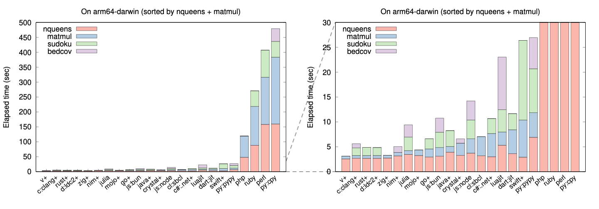

**TL;DR**: see the figure below. Note that nqueen and matmul are implemented in
all languages but sudoku and bedcov are only implemented in some.



## Table of Contents

- [Introduction](#intro)
- [Results](#result)
  - [Overall impressions](#overall)
  - [Caveats](#caveat)
    - [Startup time](#startup)
	- [Elapsed time vs CPU time](#cputime)
  - [Subtle optimizations](#opt)
	- [Optimizing inner loops](#matmul)
	- [Controlling memory layout](#memlayout)
- [Discussions](#conclusion)
- [Appendix: Timing on Apple M1 Macbook Pro](#table)

## <a name="intro"></a>Introduction

Programming Language Benchmark v2 (plb2) evaluates the performance of 20
programming languages on four CPU-intensive tasks. It is a follow-up to
[plb][plb] conducted in 2011. In plb2, all implementations use the same
algorithm for each task and their performance bottlenecks do not fall in
library functions. We do not intend to evaluate different algorithms or the
quality of the standard libraries in these languages.

The four tasks in plb2 all take a few seconds for a fast implementation to
complete. The tasks are:

* **nqueen**: solving a [15-queens problem][8queen]. The algorithm was inspired
  by the second C implementation [from Rosetta Code][8qrc]. It involves nested
  loops and integer bit operations.

* **matmul**: multiplying two square matrices of 1500x1500 in size.

* **sudoku**: solving 4000 hard [Sudokus][sudoku] (20 puzzles repeated for 200
  times) using the [kudoku algorithm][kudoku]. This algorithm heavily uses
  small fixed-sized arrays with a bit complex logic.

* **bedcov**: finding the overlaps between two arrays of 1,000,000 intervals
  with [implicit interval trees][iitree]. The algorithm involves frequent
  array access in a pattern similar to binary searches.

Every language has nqueen and matmul implementations. Some languages do not
have sudoku or bedcov implementations. In addition, I implemented most
algorithms in plb2 and adapted a few contributed matmul and sudoku
implementations in plb. As I am mostly a C programmer, implementations in other
languages may be suboptimal and implementations in functional languages are
lacking. **Pull requests are welcomed!**

## <a name="result"></a>Results

The figure at the top of the page summarizes the elapsed time of each implementation
measured on an Apple M1 MacBook Pro. [Hyperfine][hyperfine] was used for timing
except for a few slow implementations which were timed with the "time" bash
command without repetition. A plus sign "+" indicates an explicit compilation
step. Exact timing can be found in the [table](#table) towards the end of this
README. The figure was programmatically generated from the table but may be
outdated.

### <a name="overall"></a>Overall impression

Programming language implementations in plb2 can be classified into four groups
depending on how and when compilation is done:

1. Purely interpretted with no compilation (Perl and [CPython][cpy], the
   official Python implementation). Not surprisingly, these are the slowest
   language implementations in this benchmark.

2. JIT compiled without a separate compilation step (Dart, all JavaScript
   runtimes, Julia, LuaJIT, PHP, PyPy and Ruby3 with [YJIT][yjit]). These
   language implementations compile the source code on the fly and execute.
   They have to balance compilation and running time to achieve the best
   overall performance.

   In this group, although PHP and Ruby3 are faster than Perl and CPython, they
   are still tens of times slower than PyPy and others. Notably, LuaJIT was
   often [considered][luablog] as one of the fastest scripting language
   implementations 10 years ago but it is no longer competitive due to
   continuous improvements to Julia and JavaScript engines.

3. JIT compiled with a separate compilation step (Java and C#). With separate
   compilation, these language implementations can afford to generate optimized
   bytecode at length that run slightly faster at runtime, though only by a
   little in comparison to group 2.

4. [Ahead-of-time compilation][aot] (the rest). Applying all kinds of
   optimizations available on specific hardware, these compilers, except Swift,
   tend to generate the fastest executables.

### <a name="caveat"></a>Caveats

#### <a name="startup"></a>Startup time

Some JIT-based language runtimes take up to ~0.3 second to compile and warm-up.
We are not separating out this startup time. Nonetheless, because most
benchmarks run for several seconds, including the startup time does not greatly
affect the results.

#### <a name="cputime"></a>Elapsed time vs CPU time

Although no implementations use multithreading, language runtimes may be doing
extra work, such as garbage collection, in a separate thread. In this case, the
CPU time (user plus system) may be longer than elapsed wall-clock time. Julia,
in particular, takes noticeably more CPU time than wall-clock time even for the
simplest nqueen benchmark. In plb2, we are measuring the elapsed wall-clock
time because that is the number users often see. The ranking of CPU time may be
slightly different.

### <a name="opt"></a>Subtle optimizations

#### <a name="memlayout"></a>Controlling memory layout

When implementing bedcov in Julia, C and many compiled languages, it is
preferred to have an array of objects in a contiguous memory block such that
adjacent objects are close in memory. This helps cache efficiency. In most
scripting languages, unfortunately, we have to put references to objects in an
array at the cost of cache locality. The issue can be alleviated by cloning
objects to a new array. This doubles the speed of PyPy and Bun.

#### <a name="matmul"></a>Optimizing inner loops

The bottleneck of matrix multiplication falls in the following nested loop:
```cpp
for (int i = 0; i < n; ++i)
    for (int k = 0; k < n; ++k)
        for (int j = 0; j < n; ++j)
            c[i][j] += a[i][k] * b[k][j];
```
It is obvious that `c[i]`, `b[k]` and `a[i][k]` can be moved out of the inner
loop to reduce the frequency of matrix access. The Clang compiler can apply
this optimization. Manual optimization may actually hurt performance.

However, **most other languages cannot optimize this nested loop.** If we
manually move `a[i][k]` to the loop above it, we can often improve their
performance. Manual optimization may still be necessary for these languages.

## <a name="conclusion"></a>Discussions

The most well-known and the longest running language benchmark is the [Computer
Language Benchmark Games][clbg]. Plb2 differs in that it includes more recent
languages (e.g. Nim and Crystal), more language runtimes (e.g. PyPy and
LuaJIT), more tasks, comes with more uniform implementations and focuses more
on the performance of the language itself without library functions. It
complements the Computer Language Benchmark Games.

One important area that plb2 does not evaluate is the performance of memory
allocation and/or garbage collection. This may contribute more to practical
performance than generating machine code. Nonetheless, it is challenging to
design a realistic micro-benchmark to evaluate memory allocation. If the
built-in allocator in a language implementation does not work well, we can
implement customized memory allocator just for the specific task but this, in
my view, would not represent typical use cases.

## <a name="table"></a>Appendix: Timing on Apple M1 Macbook Pro

|Label    |Language  |Runtime|Version| nqueen | matmul | sudoku | bedcov |
|:--------|:---------|:------|:------|-------:|-------:|-------:|-------:|
|c:clang+ |C         |Clang  |15.0.0 | 2.70   | 0.54   | 1.54   | 0.84   |
|crystal+ |Crystal   |       |1.10.0 | 3.28   | 2.45   |        | 0.87   |
|c#:.net+ |C#        |.NET   |8.0.100| 3.00   | 4.67   | 3.01   |        |
|d:ldc2+  |D         |LDC2   |2.105.2| 2.68   | 2.30   | 1.60   |        |
|dart     |Dart      |       |3.2.4  | 3.62   | 4.81   | 3.24   |        |
|go+      |Go        |       |1.21.5 | 2.94   | 2.77   | 2.04   |        |
|java+    |Java      |OpenJDK|20.0.1 | 3.92   | 1.14   | 3.20   |        |
|js:bun   |JavaScript|Bun    |1.0.20 | 3.11   | 1.75   | 3.07   | 2.83   |
|js:deno  |JavaScript|Deno   |1.39.1 | 4.00   | 3.06   | 4.04   | 3.87   |
|js:k8    |JavaScript|k8     |1.0    | 3.79   | 2.99   | 3.76   | 4.02   |
|js:node  |JavaScript|Node   |21.5.0 | 3.73   | 2.88   | 3.77   | 3.83   |
|julia    |Julia     |       |1.10.0 | 3.75   | 5.66   | 2.72   | 2.47   |
|luajit   |Lua       |LuaJIT |2.1    | 5.31   | 2.66   | 4.48   | 10.59  |
|mojo+    |Mojo      |       |0.6.1  | 3.24   | 1.12   |        |        |
|nim+     |Nim       |       |2.0.2  | 3.18   | 0.69   |        | 1.18   |
|perl     |Perl      |       |5.34.1 | 158.34 | 158.01 | 90.78  |        |
|php      |PHP       |       |8.3    | 48.15  | 71.20  |        |        |
|py:pypy  |Python    |Pypy   |7.3.14 | 6.91   | 4.95   | 8.82   | 6.27   |
|py:cpy   |Python    |CPython|3.11.7 | 159.97 | 223.66 | 52.88  | 42.84  |
|ruby     |Ruby      |(YJIT) |3.3.0  | 88.15  | 130.51 | 52.26  |        |
|rust+    |Rust      |       |1.75.0 | 2.68   | 2.51   | 1.65   |        |
|swift+   |Swift     |       |5.9.0  | 2.92   | 7.46   | 16.02  |        |
|v+       |V         |       |0.4.3  | 2.63   | 3.17   |        |        |
|zig+     |Zig       |       |0.11.0 | 2.74   | 0.73   |        |        |

[plb]: https://github.com/attractivechaos/plb
[8queen]: https://en.wikipedia.org/wiki/Eight_queens_puzzle
[8qrc]: https://rosettacode.org/wiki/N-queens_problem#C
[sudoku]: https://en.wikipedia.org/wiki/Sudoku
[kudoku]: https://attractivechaos.github.io/plb/kudoku.html
[iitree]: https://academic.oup.com/bioinformatics/article/37/9/1315/5910546
[hyperfine]: https://github.com/sharkdp/hyperfine
[cpy]: https://en.wikipedia.org/wiki/CPython
[pypy]: https://www.pypy.org
[bun]: https://bun.sh
[luablog]: https://attractivechaos.wordpress.com/2011/01/23/amazed-by-luajit/
[yjit]: https://github.com/ruby/ruby/blob/master/doc/yjit/yjit.md
[aot]: https://en.wikipedia.org/wiki/Ahead-of-time_compilation
[clbg]: https://benchmarksgame-team.pages.debian.net/benchmarksgame/index.html
