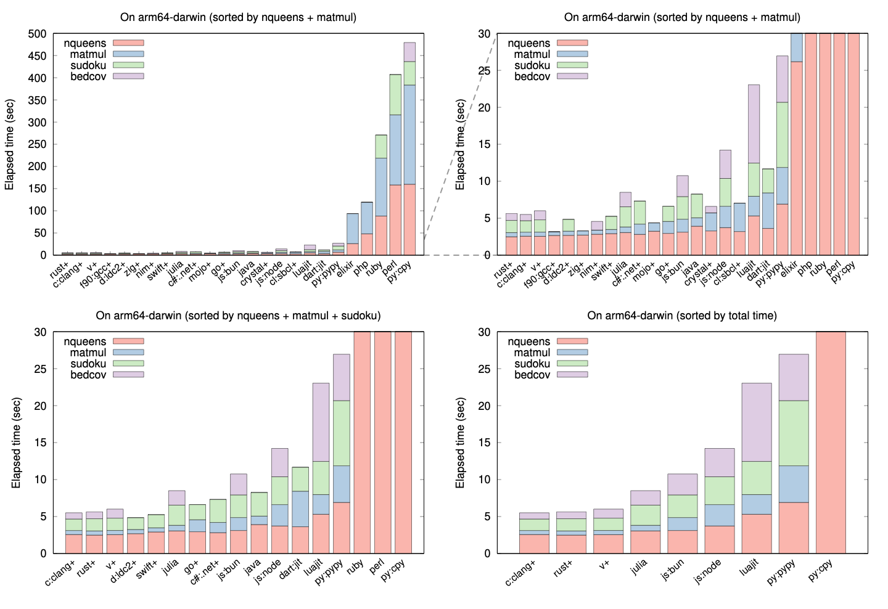

## Introduction

Programming Language Benchmark v2 (plb2) evaluates the performance of 20
programming languages on four CPU-intensive tasks. It is a follow-up to
[plb][plb] conducted in 2011. In plb2, all implementations use the same
algorithm for each task and their performance bottlenecks do not fall in
library functions. We do not intend to evaluate different algorithms or the
quality of the standard libraries in these languages.

The four tasks in plb2 all take a few seconds for a fast implementation to
complete. The tasks are:

* **nqueen**: solving a [15-queens problem][8queen]. The algorithm was inspired
  by the second C implementation [from Rosetta Code][8qrc]. It involves nested
  loops and integer bit operations.

* **matmul**: multiplying two square matrices of 1500x1500 in size.

* **sudoku**: solving 4000 hard [Sudokus][sudoku] (20 puzzles repeated for 200
  times) using the [kudoku algorithm][kudoku]. This algorithm heavily uses
  small fixed-sized arrays with a bit complex logic.

* **bedcov**: finding the overlaps between two arrays of 1,000,000 intervals
  with [implicit interval trees][iitree]. The algorithm involves frequent
  array access in a pattern similar to binary searches.

Every language has nqueen and matmul implementations. Some languages do not
have sudoku or bedcov implementations. In addition, I implemented most
algorithms in plb2 and adapted a few contributed matmul and sudoku
implementations in plb. As I am mostly a C programmer, implementations in other
languages may be suboptimal and implementations in functional languages are
lacking. **Pull requests are welcomed!**

## Results and Discussions

The following figure summarizes the elapsed time of each implementation
measured on an Apple M1 MacBook Pro. [Hyperfine][hyperfine] was used for timing
except for a few slow implementations which were timed with the "time" bash
command without repetition. A plus sign "+" indicates an explicit compilation
step. Exact timing can be found in the table towards the end of this README.
The figure was programmatically generated from the table but may be outdated.



### Overall impression

It is not surprising that purely interpreated languages including Perl and
[CPython][cpy] (the official Python implementation) are the slowest. Although
the latest PHP and Ruby have integrated JIT compilation and are faster than
Perl and CPython, they do not compete with [PyPy][pypy], a JIT-based Python
implementation. It is unfortunate that PyPy is not adopted as the official
Python implementation.

The other JIT-based language implementations without requiring a separate
compilation step, including [Bun][bun] and Node for JavaScript, Dart, LuaJIT,
PyPy and Julia, are broadly comparable in performance. They are tens of times
faster than PHP, Ruby, Perl and CPython. Although Julia is somehow slower on
matmul, it is a lot faster on bedcov (see side notes below for explanation).
LuaJIT was often [considered][luablog] as one of the fastest scripting language
implementations but it is no longer competitive due to continuous improvements
to the Julia and JavaScript runtimes.

Except Swift, language implementations requiring explicit compilation are also
broadly comparable in performance. They are probably all fast enough for
practical use cases. Nonetheless, no task in plb2 puts stress on memory
allocations. We might see large differences for a task allocating millions of
small objects.

### Side notes

#### Most language implementations cannot optimize matmul

The bottleneck of matrix multiplication falls in the following nested loop:
```cpp
for (int i = 0; i < n; ++i)
    for (int k = 0; k < n; ++k)
        for (int j = 0; j < n; ++j)
            c[i][j] += a[i][k] * b[k][j];
```
It is obvious that `c[i]`, `b[k]` and `a[i][k]` can be moved out of the inner
loop to reduce the frequency of matrix access. The Clang compiler can apply
this optimization. Manual optimization may actually hurt performance.

However, most other languages cannot optimize this nested loop. If we manually
move `a[i][k]` to the loop above it, we can often improve their performance.
Manual optimization may still be necessary.

#### Elapsed time vs CPU time

Although all implementations intend to use one thread only, language runtimes
may invoke garbage collection in a separate thread. In this case, the CPU time
(user plus system) may be longer than elapsed wall-clock time. Julia, in
particular, takes noticeably more CPU time than wall-clock time even for the
simplest nqueen benchmark. In plb2, we are measuring the elapsed wall-clock
time. The ranking of CPU time may be slightly different.

#### Startup time

### Tabled results on Apple M1 Macbook Pro

|Label    |Language  |Runtime|Version| nqueen | matmul | sudoku | bedcov |
|:--------|:---------|:------|:------|-------:|-------:|-------:|-------:|
|c:clang+ |C         |Clang  |15.0.0 | 2.70   | 0.54   | 1.54   | 0.84   |
|crystal+ |Crystal   |       |1.10.0 | 3.28   | 2.45   |        | 0.87   |
|cs:.net+ |C#        |.NET   |8.0.100| 3.00   | 4.67   | 3.01   |        |
|d:ldc2+  |D         |LDC2   |2.105.2| 2.68   | 2.30   | 1.60   |        |
|dart     |Dart      |       |3.2.4  | 3.62   | 4.81   | 3.24   |        |
|go+      |Go        |       |1.21.5 | 2.94   | 2.77   | 2.04   |        |
|java+    |Java      |OpenJDK|20.0.1 | 3.92   | 1.14   | 3.20   |        |
|js:bun   |JavaScript|Bun    |1.0.20 | 3.11   | 1.75   | 3.07   | 6.33   |
|js:deno  |JavaScript|Deno   |1.39.1 | 4.00   | 3.06   | 4.04   | 6.50   |
|js:k8    |JavaScript|k8     |1.0    | 3.79   | 2.99   | 3.76   | 6.66   |
|js:node  |JavaScript|Node   |21.5.0 | 3.73   | 2.88   | 3.77   | 6.36   |
|julia    |Julia     |       |1.10.0 | 3.75   | 5.66   | 2.72   | 2.47   |
|luajit   |Lua       |LuaJIT |2.1    | 5.31   | 2.66   | 4.48   | 14.91  |
|mojo+    |Mojo      |       |0.6.1  | 3.24   | 1.12   |        |        |
|nim+     |Nim       |       |2.0.2  | 3.18   | 0.69   |        | 1.18   |
|perl     |Perl      |       |5.34.1 | 158.34 | 158.01 | 90.78  |        |
|php      |PHP       |       |8.3    | 48.15  | 71.20  |        |        |
|py:pypy  |Python    |Pypy   |7.3.14 | 6.91   | 4.95   | 8.82   | 14.21  |
|py:cpy   |Python    |CPython|3.11.7 | 159.97 | 223.66 | 52.88  | 55.15  |
|ruby     |Ruby      |(YJIT) |3.3.0  | 88.15  | 130.51 | 52.26  |        |
|rust+    |Rust      |       |1.75.0 | 2.68   | 2.51   | 1.65   |        |
|swift+   |Swift     |       |5.9.0  | 3.01   | 9.70   | 21.40  |        |
|v+       |V         |       |0.4.3  | 2.63   | 3.17   |        |        |
|zig+     |Zig       |       |0.11.0 | 2.74   | 0.73   |        |        |

[plb]: https://github.com/attractivechaos/plb
[8queen]: https://en.wikipedia.org/wiki/Eight_queens_puzzle
[8qrc]: https://rosettacode.org/wiki/N-queens_problem#C
[sudoku]: https://en.wikipedia.org/wiki/Sudoku
[kudoku]: https://attractivechaos.github.io/plb/kudoku.html
[iitree]: https://academic.oup.com/bioinformatics/article/37/9/1315/5910546
[hyperfine]: https://github.com/sharkdp/hyperfine
[cpy]: https://en.wikipedia.org/wiki/CPython
[pypy]: https://www.pypy.org
[bun]: https://bun.sh
[luablog]: https://attractivechaos.wordpress.com/2011/01/23/amazed-by-luajit/
